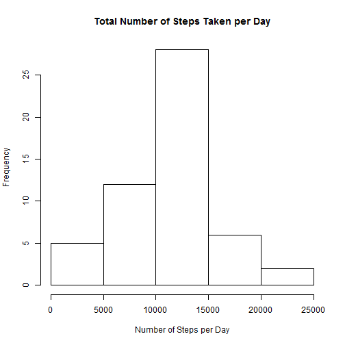
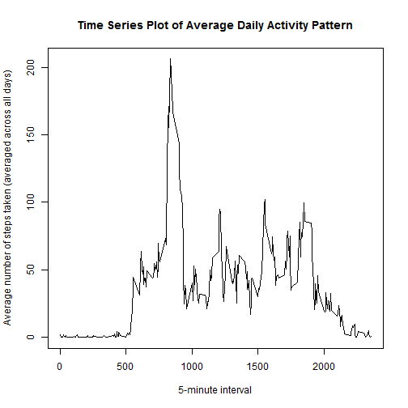
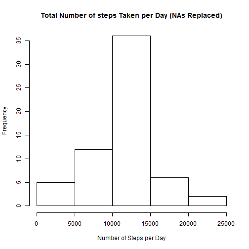
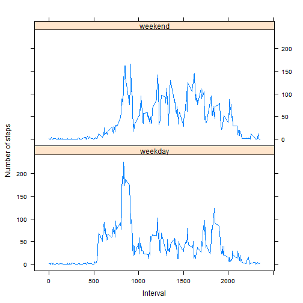

# Reproducible Research: Peer Assessment 1


## Loading and preprocessing the data

### Loading the data


```r
activity <- read.csv(unz("activity.zip", "activity.csv"))
```

### Pre-processing of data


```r
# Create new variable for dates with date type
activity$Date <- as.Date(activity$date, format = "%Y-%m-%d")

# Create new data frame for total steps per day
activity.day <- aggregate(activity$steps, 
                by = list(activity$date), sum)
names(activity.day)[1] <- "day"
names(activity.day)[2] <- "steps"

# Create new data frame for total steps per interval
activity.interval <- aggregate(activity$steps, 
                        by = list(activity$interval), sum, 
                        na.rm = TRUE, na.action = NULL)
names(activity.interval)[1] <- "interval"
names(activity.interval)[2] <- "steps"

# Create new data frame for mean steps per interval
activity.mean.interval <- aggregate(activity$steps, 
                                by = list(activity$interval), mean, 
                                na.rm = TRUE, na.action = NULL)
names(activity.mean.interval)[1] <- "interval"
names(activity.mean.interval)[2] <- "mean.steps"
```


## What is mean total number of steps taken per day?

### Histogram of total number of steps taken per day


```r
hist(activity.day$steps, main = "Total Number of Steps Taken per Day", 
        xlab = "Number of Steps per Day")
```

 

### Mean and median total number of steps taken per day

1. The mean number of steps per day is 1.0766 &times; 10<sup>4</sup>, or 10766 steps.


```r
mean(activity.day$steps, na.rm = TRUE)
```

```
## [1] 10766
```

2. The median number of steps per day is 10765 steps.


```r
median(activity.day$steps, na.rm = TRUE)
```

```
## [1] 10765
```


## What is the average daily activity pattern?

### Time series plot


```r
plot(activity.mean.interval$interval, activity.mean.interval$mean.steps, 
     type = "l", main = "Time Series Plot of Average Daily Activity Pattern", 
     xlab = "5-minute interval", 
     ylab = "Average number of steps taken (averaged across all days)")
```

 

### Maximum number of steps


```r
# 5-minute interval that contains the most numbe rof steps, averaged across all days

activity.mean.interval[which.max(activity.mean.interval$mean.steps), 1]
```

```
## [1] 835
```

```r
activity.mean.interval[which.max(activity.mean.interval$mean.steps), 2]
```

```
## [1] 206.2
```

The 5-minute interval that contains the maximum number of steps, avergaed across all the days in the dataset, is the interval occuring between 8:35AM and 8:40AM. The number of steps corresonding with this interval is 206.1698 steps.


## Imputing missing values

### Total number of missing values


```r
sum(is.na(activity$steps))
```

```
## [1] 2304
```

The total number of missing values in the dataset is 2304

### Replacement of missing values


```r
# Merging activity and activity.mean.interval data frames
activity.missing <- merge(activity, activity.mean.interval, 
                          by = "interval", sort = FALSE)

# Sorting on variables date and interval
activity.missing <- activity.missing[with(activity.missing, 
                                          order(date, interval)), ]

# Insert steps from original data frame
activity.missing$origsteps <- activity$steps

# Replace NAs with mean per interval
activity.missing$steps[is.na(activity.missing$steps)] <- 
        activity.missing$mean.steps[is.na(activity.missing$steps)]
```

### Creation of new dataset with missing values included


```r
activity.new <- activity.missing[, c(2, 3, 1)]
activity.new$Date <- as.Date(activity.new$date, format = "%Y-%m-%d")
```

### Histogram, mean, and median of total steps taken per day


```r
# Create new data frame for total steps per day from new dataset
activity.day.new <- aggregate(activity.new$steps, 
                              by = list(activity.new$date), sum)
names(activity.day.new)[1] <- "day"
names(activity.day.new)[2] <- "steps"

# Histogram of total number steps taken per day
hist(activity.day.new$steps, 
     main = "Total Number of steps Taken per Day (NAs Replaced)", 
     xlab = "Number of Steps per Day")
```

 

```r
# Mean number of steps per day
mean(activity.day.new$steps)
```

```
## [1] 10766
```

```r
# Median number of steps per day
median(activity.day.new$steps)
```

```
## [1] 10766
```

Both the mean median total number of steps taken per day is 1.0766 &times; 10<sup>4</sup> steps. In comparison to the mean median figures calculated earlier, both the mean total number of steps per day are equivalent to one another. With regards to the median number of steps per day, the new median figure is 1.19 steps higher than the median figure calculated earlier.

The impact of imputing missing data via the strategy utilized above is that the ensuing results are similar to the results generated earlier, with slightly higher frequencies overall, due to the replacement of the NAs.


## Are there differences in activity patterns between weekdays and weekends?

### Create new factor variable


```r
# Copying the new dataset
activity.new.2 <- activity.new

# Create weekday/weekend factor
activity.new.2$weekdays <- factor(format(activity.new.2$Date, "%A"))
levels(activity.new.2$weekdays) <- 
        list(weekday = c("Monday", "Tuesday", "Wednesday", 
                         "THursday", "Friday"), 
             weekend = c("Saturday", "Sunday"))
```

### Panel plot of time series plots


```r
# Create new data frame for mean steps per interval from new dataset
activity.new.2.mean.interval <- aggregate(activity.new.2$steps, 
                                          by = list(activity.new.2$weekdays, 
                                                    activity.new.2$interval), 
                                          mean)
names(activity.new.2.mean.interval)[1] <- "weekday"
names(activity.new.2.mean.interval)[2] <- "interval"
names(activity.new.2.mean.interval)[3] <- "mean.steps"

# Panel plot
library(lattice)
xyplot(activity.new.2.mean.interval$mean.steps ~ 
               activity.new.2.mean.interval$interval | 
               activity.new.2.mean.interval$weekday, layout = c(1, 2), 
       type = "l", xlab = "Interval", ylab = "Number of steps")
```

 
